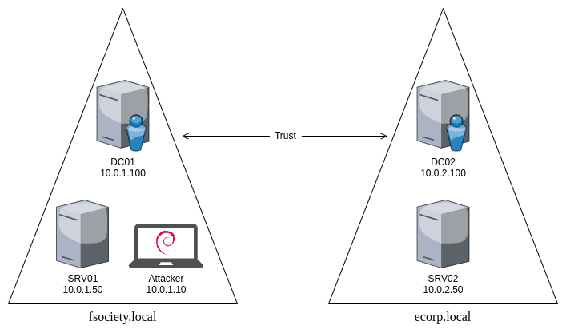

# Active Directory AWS Lab


## Description

Intentionally vulnerable Active Directory network that can be deployed on AWS. The purpose of this lab project is to provide pentesters and students with a vulnerable remote environment, which can be used to practice and learn Active Directory pentesting.

By being a remote lab on AWS, this project solves the drawbacks of local AD labs (very high requirements on disk space and memory) at a small cost.


## Summary

This project uses Terraform to deploy the AD network on AWS. The environment is composed of two domains with bidirectional trust and five machines.

fsociety.local:
* DC01 (Windows Server 2019)
* SRV01 (Windows Server 2019)
* Attacker (Debian 10)

ecorp.local:
* DC02 (Windows Server 2019)
* SRV02 (Windows Server 2019)




## Requirements

* Terraform CLI
* AWS CLI
* AWS account


## Setting up the lab

### 1. Clone this repository

```
$ git clone https://github.com/0xDrogon/activedirectory-lab.git
```

### 2. AWS Setup

Create a new AWS Access Key and run:

```
$ aws configure
```

When it asks you for your Access Key ID and Secret Access Key, copy both values from the AWS Access Key you just created. When it asks you for the default region name, you can type `eu-west-1` (the region being used by this project). You can also choose a different region but, if you do so, you should also change it in the [main.tf](./terraform/main.tf) file.

Create an EC2 key pair with private key format `.pem`. Save it under `terraform/keys/terraform_key.pem` and run:

```
$ chmod 400 terraform/keys/terraform_key.pem
$ ssh-keygen -y -f terraform/keys/terraform_key.pem
```

Copy the output (your public key) and store it under `terraform/keys/terraform_key.pub`.

### 3. Terraform variables

You need to fill in some variables in Terraform's [vars.tf](./terraform/vars.tf) file that are specific to you. First, you need to add the IP address (or list of IP addresses) that you are going to be using to manage the deployed instances in the `MANAGEMENT_IPS` variable. Then, choose a name for your S3 bucket and assign it to the `S3_BUCKET` variable (mind that the name must be globally unique!).

### 4. Deployment

The lab is now ready to be deployed.

```
$ cd terraform
$ terraform init
$ terraform apply
```

### 5. Destroying the lab

If you want to destroy the lab, run:

```
$ cd terraform
$ terraform destroy
```


## Connecting to the environment

You can use RDP to connect to all Windows Servers using the domain users and respective credentials. However, you need to wait about 1 hour after you deploy the lab (check the timestamp outputted by Terraform).

The attacker instance can be accessed right after Terraform finishes the execution by using SSH with the private key previously created:

```
$ ssh -i terraform/keys/terraform_key.pem admin@<attacker_ip>
```


## AD domain users and passwords

| User             | Password                  | Domain         | Description                       |
|------------------|---------------------------|----------------|-----------------------------------|
| admin            | I_4m_D0m41n_Adm1n15tr4t0r | fsociety.local | Administrator                     |
| mr.robot         | !LeAvE_mE_hErE!           | fsociety.local | DNS administrator                 |
| elliot.alderson  | ShAyLa_QwErTy_KrIsTa      | fsociety.local | Constrained delegation            |
| darlene.alderson | M00np1&                   | fsociety.local | Unconstrained delegation          |
| leslie.romero    | RGFyayBBcm15              | fsociety.local | Plaintext password in description |
| angela.moss      | Jogging1988               | fsociety.local | Kerberos preauth disabled         |
| leon             | Password123               | fsociety.local | Weak password                     |
| admin            | I_4m_D0m41n_Adm1n15tr4t0r | ecorp.local    | Administrator                     |
| phillip.price    | Ecorp0704                 | ecorp.local    | Regular user                      |
| terry.colby      | Ecorp0508                 | ecorp.local    | Regular user                      |
| tyrell.wellick   | VastraGotalandsIan1982    | ecorp.local    | Regular user                      |


## Attacks tested (so far)

* User Enumeration
* Password Spraying
* User with cleartext password in the description
* AS-REP Roasting
* Kerberoasting 
* SMB Relay
* Rogue WPAD server
* Golden Ticket


## Cost

The estimated cost of this lab on AWS is 0.12$ per hour (~90$ per month, in case the instances are always running).


## Credits

This project is based on [@PhilKeeble](https://github.com/PhilKeeble/AWS-RedTeam-ADLab)'s version of [@xpn](https://github.com/xpn/DemoLab)'s AD lab and on [GOAD](https://github.com/Orange-Cyberdefense/GOAD).

Names on this project were inspired by the *Mr. Robot* TV show.


## Disclaimer

This lab is extremely vulnerable and intended for educational purposes only. Do not use it in production.
